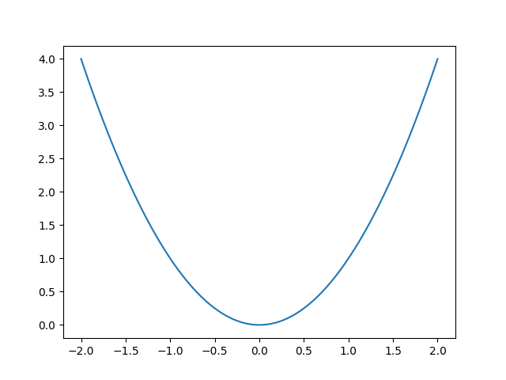
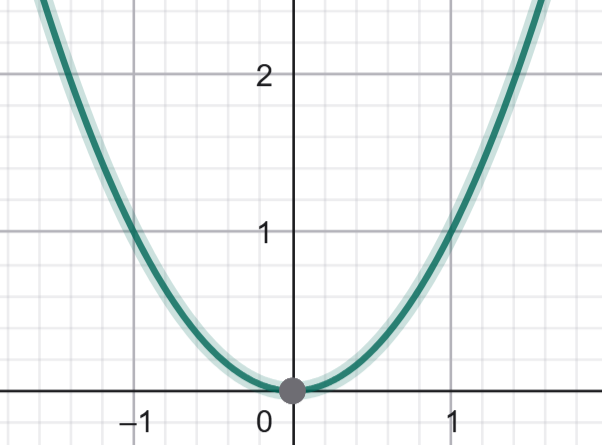

# Asymptote

## O que é Asymptote?

Asymptote é uma poderosa linguagem de descrição gráfica vetorial, desenvolvida especificamente para a criação de figuras matemáticas e diagramas técnicos de alta precisão. Foi desenvolvida por Andy Hammerlindl, John C. Bowman e Tom Price [1].
Diferente de ferramentas de desenho interativas (como o GeoGebra [2]) ou linguagens de análise de dados (como o Python com a biblioteca Matplotlib [3]), o Asymptote não é um programa onde se clica e arrasta. Ele é uma linguagem de programação. O usuário escreve um código que descreve a figura, e um compilador interpreta esse código para gerar o arquivo de imagem final.
Essa abordagem funciona como uma ponte entre a lógica do código e a perfeição da saída gráfica. Ele une o melhor dos dois mundos: código estruturado + saída gráfica exata e escalável, o que o torna a ferramenta definitiva para publicações científicas, relatórios técnicos e materiais didáticos de matemática, física e engenharia [1, 3].

### Características e Vantagens

A estrutura do Asymptote, baseada em código, oferece um conjunto único de vantagens que o tornam ideal para publicações científicas e documentação técnica.

- **Precisão Matemática Absoluta** A precisão do Asymptote deriva de sua natureza programática, sendo ideal para gráficos técnicos e científicos. Diferente de ferramentas visuais onde um ponto é "arrastado" para uma posição (podendo resultar em (2.99, 5.01)), no Asymptote um ponto é declarado com coordenadas exatas, como (3, 5), ou calculado como a interseção de duas curvas. Isso elimina qualquer ambiguidade ou erro de "desenho à mão". Para gráficos técnicos, isso é fundamental: em um diagrama de engenharia, a interseção de duas linhas não está "próxima" de um ponto, ela é o ponto. Em uma prova geométrica, uma linha tangente toca um círculo em exatamente um ponto, calculado pela linguagem. Essa abordagem garante que a ilustração seja uma representação fiel do modelo matemático, e não apenas uma aproximação visual [1].

- **Linguagem de Programação Própria (Sintaxe similar a C++)** Qualquer pessoa com familiaridade em linguagens como C++, Java ou C# encontrará a sintaxe do Asymptote muito natural. Isso permite o uso de variáveis, loops, condicionais e funções para construir gráficos complexos de forma lógica e parametrizada [1]. A filosofia é que a linguagem foi construída para desenhar; cada comando tem um propósito gráfico direto.

- **Geração Nativa de Gráficos Vetoriais (PDF, EPS, SVG)** Diferente de formatos raster (como PNG ou JPG), os gráficos vetoriais são baseados em equações matemáticas, não em pixels. Isso significa que eles podem ser redimensionados infinitamente (zoom) sem qualquer perda de qualidade, resultando em linhas perfeitamente nítidas e texto legível em qualquer resolução [1].

- **Integração Profunda com LaTeX** Esta é, talvez, a vantagem mais crucial para o meio acadêmico. O Asymptote pode delegar a renderização de todo o texto (rótulos, títulos, eixos) para o motor do LaTeX [1, 3]. Isso permite incluir expressões matemáticas complexas diretamente nas figuras, mantendo o mesmo estilo de fonte e qualidade do documento principal. A consistência visual é total, sem necessidade de pós-edição.

#### Exemplo de integração LaTeX:
```import graph;
size(8cm);
real f(real x) { return sin(x); }

draw(graph(f, 0, 2*pi), blue);
// Este rótulo é processado pelo LaTeX
label("$\int_0^{2\pi} \sin(x) dx = 0$", (pi, -0.5), S);

xaxis("$x$", 0, 2.1*pi, Ticks(Step=pi, ticklabel="$\pi$"));
yaxis("$y$", -1.5, 1.5);
```

- **Suporte Nativo para Gráficos 2D e 3D** O Asymptote utiliza um framework coeso para a criação de ambos os tipos de gráficos, permitindo a criação de visualizações 3D complexas, como superfícies de funções e campos vetoriais, com o mesmo nível de precisão do 2D [1].

- **Reprodutibilidade e Versionamento** Por ser uma linguagem baseada em código, o Asymptote garante reprodutibilidade científica. Qualquer gráfico pode ser recriado exatamente, bastando executar o código. Isso elimina erros manuais e facilita a manutenção e o controle de versões em repositórios (como o Git/GitHub) [1].

- **Automação e Padronização** Como uma linguagem de programação, o Asymptote permite a criação de funções e templates. Imagine a necessidade de gerar 50 gráficos de funções diferentes para um livro, todos devendo ter exatamente o mesmo estilo (cores, espessura de linha, tamanho de fonte nos eixos). Em vez de criar 50 gráficos manualmente em uma ferramenta visual, o usuário pode definir uma única função (ex: desenharGraficoPadrao(funcao f, real x_min, real x_max)) que cuida de toda a formatação. O processo de geração dos 50 gráficos se torna um loop que apenas chama essa função com diferentes parâmetros. Isso não só economiza um tempo imenso, mas garante uma padronização visual perfeita em todo o documento, algo extremamente difícil de alcançar com ferramentas manuais.


## Desvantagens e Desafios

Apesar de suas vantagens técnicas, a adoção do Asymptote apresenta barreiras significativas.

- **Documentação Densa e Comunidade Pequena** A documentação oficial [1], embora completa, é um manual de referência denso e pouco acessível para iniciantes. A comunidade de usuários é significativamente pequena em comparação com os ecossistemas de Python [3] ou GeoGebra [2], o que torna a busca por soluções e exemplos muito difícil.

- **Suporte de Inteligencia Artificial Praticamente inexistente:** Ferramentas de IA generatica, como ChatGPT, Copilot, dentre outras, têm um conhecimento muito limitado sobre a sintaxe e as bibliotecas do Asymptote. Elas frequentemente geram códigos incorretos ou "alucinam" funcionalidades,tornando-as pouco confiáveis para auxiliar no desenvolvimento.

- **Dificuldade de Busca por Informações:** O nome "Asymptote" é um termo matemático comum. Isso torna as buscas online um desafio, pois os resultados quase sempre remetem ao conceito matemático em si. Tornando uma necessidade utilizar termos que referenciam ela como uma linguagem de programação grafica.

- **Curva de Aprendizagem** Para usuários sem experiência em programação, a curva de aprendizagem é íngreme. A necessidade de entender a lógica de programação e a sintaxe específica é uma barreira considerável em comparação com interfaces gráficas [2].

- **Diferença de Complexidade entre 2D e 3D** A criação de gráficos 3D não é uma extensão trivial do 2D. Ela exige a importação de bibliotecas diferentes (como a three.asy) e a compreensão de conceitos mais complexos, como projeção de câmera, iluminação e ordenação de superfícies [1].


## Compilador e Ambiente:

### Compilador vs. Ambiente:

- **Compilador:** É o "motor" que interpreta o código Asymptote (.asy) e o transforma em uma imagem (PDF, EPS, SVG etc.).

- **Ambiente:** É o local onde o código é escrito e editado (um editor de texto como VS Code, TeXstudio, ou uma plataforma online).

### Compiladores Principais:

- **asy (Compilador Oficial):** É a ferramenta de linha de comando (CLI) que processa os arquivos .asy e gera as imagens. É o coração do sistema.

- **TeXLive / MiKTeX:** As principais distribuições LaTeX geralmente incluem o asy em seu pacote de utilitários, facilitando a integração.

### Ambientes de Desenvolvimento (IDEs):

- **TeXstudio:** Um dos melhores editores LaTeX, pois permite configurar comandos de usuário para compilar o Asymptote automaticamente como parte do processo de geração do PDF.

- **Visual Studio Code:** Com extensões, é possível obter destaque de sintaxe e configurar tarefas de compilação.

- **Overleaf (Uso Online):** [4] É possível usar, mas requer configuração avançada (um arquivo latexmkrc) para instruir o servidor a como compilar os arquivos .asy. A experiência de uso, no entanto, é fortemente impactada pelo plano (gratuito vs. pago). A principal diferença para um usuário de Asymptote está no tempo de compilação. Projetos no plano gratuito têm um 'timeout' (limite de tempo) de compilação mais curto. Gráficos Asymptote, especialmente os 3D ou múltiplos gráficos 2D, são pesados e precisam ser compilados pelo asy antes que o LaTeX possa gerar o PDF. É muito comum que projetos complexos com Asymptote atinjam esse limite de tempo no plano gratuito, resultando em erro.

    Além disso, os planos pagos (Student, Standard, etc.) oferecem vantagens cruciais para um fluxo de trabalho baseado em código:

    - Histórico Completo do Projeto: O plano gratuito limita o histórico a 24 horas. Com um plano pago, o usuário tem acesso ao histórico completo, permitindo reverter mudanças em um arquivo .asy que parou de funcionar.

    - Integração Git e GitHub: Usuários pagos podem sincronizar seu projeto Overleaf com um repositório Git, permitindo versionar os arquivos .asy como código-fonte.

    - Mais Colaboradores: O plano gratuito é limitado a um colaborador, enquanto os pagos permitem 6, 10 ou mais.

    Vale notar que o tempo de compilação e o histórico são definidos pelo dono do projeto. Se um usuário gratuito for convidado para um projeto de um usuário pago, ele se beneficia desses recursos.

- **Fluxo de Trabalho Típico (Uso Local):**

    1. Escrever o código em um arquivo, por exemplo, meu_grafico.asy.

    1. Compilar via linha de comando: asy meu_grafico.asy.

    1. Resultado: Um arquivo meu_grafico.pdf (ou outro formato) é gerado.

    1. Para integração com LaTeX: O processo é ainda mais poderoso, onde o próprio compilador do LaTeX (com um comando especial) chama o Asymptote para gerar as imagens "on-the-fly" e incluí-las no PDF final.

## Exemplos de Gráficos — Asymptote, GeoGebra e Python

Vamos comparar o processo mais simples para gerar um gráfico da função $y = x^2$ nas três ferramentas.

1. **Asymptote (Foco: Publicação)**
    - **Processo (Código):** O usuário escreve um script .asy. A versão mínima ainda exige a importação de bibliotecas, definição da função e desenho explícito.

    

    ```
    // Arquivo: parabola.asy
    size(6cm);
    import graph;

    real f(real x) { return x^2; }
    draw(graph(f, -2, 2), blue);
    xaxis("$x$", -2, 2, Arrows);
    yaxis("$y$", 0, 4, Arrows); 
    ```

    - **Comando:** asy parabola.asy

    - **Saída:** Um arquivo vetorial parabola.pdf (ou .eps, .svg). O processo é 100% automatizável e reprodutível.


2. **Python (Foco: Análise de Dados)**

    - Processo (Código): O usuário escreve um script .py. O mínimo envolve importar a biblioteca, definir os dados (ou a função) e "mostrar" o gráfico.

    

    ```
    # Arquivo: parabola.py
    import matplotlib.pyplot as plt
    import numpy as np

    x = np.linspace(-2, 2, 100)

    plt.plot(x, x**2)
    plt.show() # Abre uma janela pop-up com o gráfico
    ```

    - **Comando:** python parabola.py

    - **Saída:** Uma janela interativa (gerada pelo plt.show()). Para salvar, o usuário clicaria no ícone de "salvar" na janela ou trocaria plt.show() por plt.savefig('parabola.png').

3. **GeoGebra (Foco: Interação Visual)**

    
    

    - **Processo (Interface Gráfica):**

        1. Entrada: O usuário digita x^2 na barra de "Entrada".

        2. Visualização: O gráfico aparece instantaneamente.

    - **Saída:** A imagem é visualizada na tela. Para usá-la em outro lugar, o fluxo é manual:

        - O usuário deve navegar até Menu > Exportar Imagem ou Menu > Baixar como.

        - Uma alternativa comum é a captura de tela ("Print Screen").

    - **Desvantagem:** Este fluxo é manual e não reprodutível por código. Torna-se complicado para publicações sérias, pois não há garantia de consistência (tamanho da fonte, enquadramento) entre diferentes gráficos.


## O Nicho de Excelência: Por que Usar Asymptote?

Dadas as desvantagens e a existência de ferramentas mais fáceis como GeoGebra e mais populares como Python, por que alguém escolheria o Asymptote?

A resposta é que o Asymptote é a melhor ferramenta do mundo para um trabalho muito específico: a criação de ilustrações técnicas, estáticas e de alta precisão para publicações acadêmicas e técnicas baseadas em LaTeX.

### Use Asymptote quando:

- **A Qualidade Tipográfica for Inegociável:** Você precisa que as fontes e fórmulas ($\vec{F} = m \vec{a}$) dentro do gráfico sejam idênticas ao texto do seu documento LaTeX.
- **A Precisão for Absoluta:** Você está desenhando um diagrama geométrico ou um campo vetorial onde os pontos devem estar em posições exatas definidas por equações.
- **A Consistência e Automação forem Necessárias:** Você precisa gerar 50 gráficos para um livro que devem seguir exatamente o mesmo padrão (cores, fontes, etc.).

### Não use Asymptote para:

- Analisar um conjunto de dados de um CSV (Use Python).

- Explorar interativamente como uma função muda (Use GeoGebra).

- Fazer um gráfico rápido para uma apresentação (Use GeoGebra ou Excel).

## Tabela Comparativa

| Critério    | Asymptote | GeoGebra| Python (Matplotlib)| 
|-------------|----------|--------|--------|
| Precisão    | Matemática (vetorial)  | Alta (visual/manual) | Boa (geralmente raster)
| Controle| Total (via código)|	Limitado (via interface)|	Alto (via código)
| Integração LaTeX    | Nativa e Perfeita |	Nenhuma	 | Limitada (emulação)
| Escalabilidade | Infinita	| Boa	| Limitada
| Curva de Aprendizado | Alta |	Baixa |	Média
|Uso Ideal | Artigos e publicações |	Ensino e exploração |	Análise de dados


## Conclusão

O Asymptote é uma ferramenta poderosa e precisa, consolidando-se como um "canivete suíço" para a criação de gráficos científicos, oferecendo controle total sobre cada aspecto visual por meio de código [1].

Embora apresente uma curva de aprendizado mais exigente e uma comunidade menor, sua precisão matemática, integração nativa com LaTeX [1] e qualidade vetorial infinita o tornam a melhor opção para trabalhos que exigem rigor técnico e reprodutibilidade. Aprender Asymptote é um investimento de longo prazo na qualidade da documentação científica.

Em resumo, enquanto o GeoGebra facilita a visualização interativa [2] e o Python domina a análise de dados [3], o Asymptote se firma como a linguagem ideal para a representação gráfica científica, garantindo resultados profissionais e tecnicamente impecáveis.

## Recursos da Comunidade e Repositórios

 Como mencionado nas desvantagens, a documentação oficial é densa. Os links a seguir são recursos essenciais da comunidade para encontrar exemplos de código práticos e obter ajuda.

- [GitHub - vectorgraphics/asymptote](vectorgraphics/asymptote): O repositório oficial do código-fonte do Asymptote. Útil para acompanhar o desenvolvimento e reportar bugs.

- [GitHub - pivaldi/asymptote-exemples](pivaldi/asymptote-exemples): Uma excelente e vasta coleção de exemplos de gráficos 2D e 3D, servindo como uma galeria não oficial.

- [GitHub - Jlexender/geometry3](Jlexender/geometry3): Um exemplo de módulo avançado criado pela comunidade para construções de geometria 3D.

- [TeX - LaTeX Stack Exchange](https://tex.stackexchange.com/questions/tagged/asymptote): Este é o principal fórum online para obter ajuda. Quase todas as dúvidas sobre a integração do Asymptote com o LaTeX já foram respondidas aqui.

## Referências

[1] Hammerlindl, A., Bowman, J.C., & Prince, T. (2024). Asymptote: The Vector Graphics Language (Version 2.91). Manual Oficial. Acessado em 19 de outubro de 2025. Disponível em: https://asymptote.sourceforge.io/asymptote.pdf (Esta é a fonte primária para todas as afirmações sobre o que o Asymptote é, quem o criou e suas características técnicas, como sintaxe, integração LaTeX e saída vetorial).

[2] GeoGebra (2025). GeoGebra Official Website. Acessado em 19 de outubro de 2025. Disponível em: https://www.geogebra.org (Referência para as afirmações sobre o GeoGebra ser focado em interação visual e ensino).

[3] Hunter, J. D. (2007). Matplotlib: A 2D graphics environment. Computing in Science & Engineering, 9(3), 90-95. (Veja também: https://matplotlib.org) (Referência principal para a biblioteca Matplotlib do Python, seu foco em "plotting" 2D e análise de dados).

[4] Overleaf (2025). Premium features. Documentação Oficial do Overleaf. Acessado em 19 de outubro de 2025. Disponível em: https://docs.overleaf.com/getting-started/free-and-premium-plans/premium-features (Referência para as diferenças entre os planos gratuito e pago do Overleaf, incluindo tempo de compilação, histórico e integração Git).


